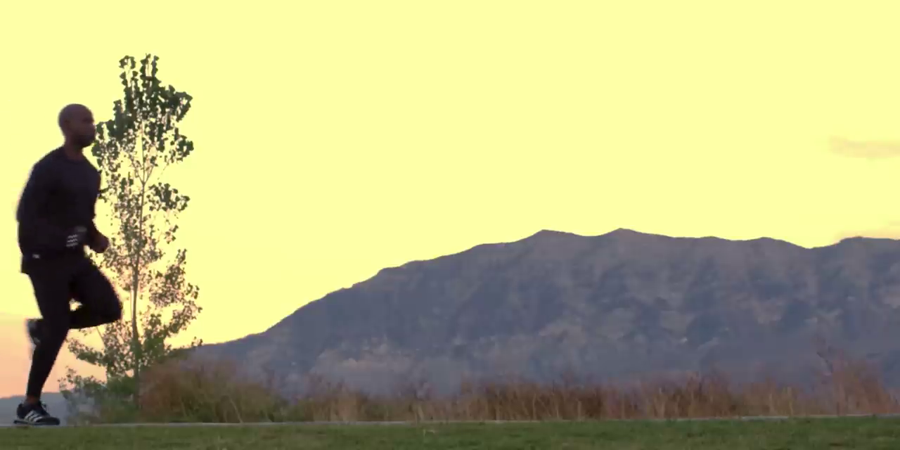
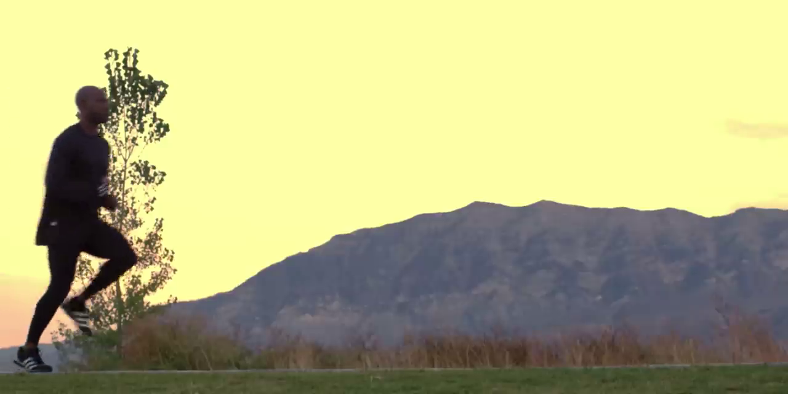
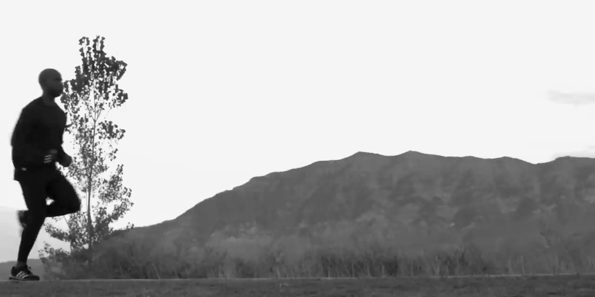
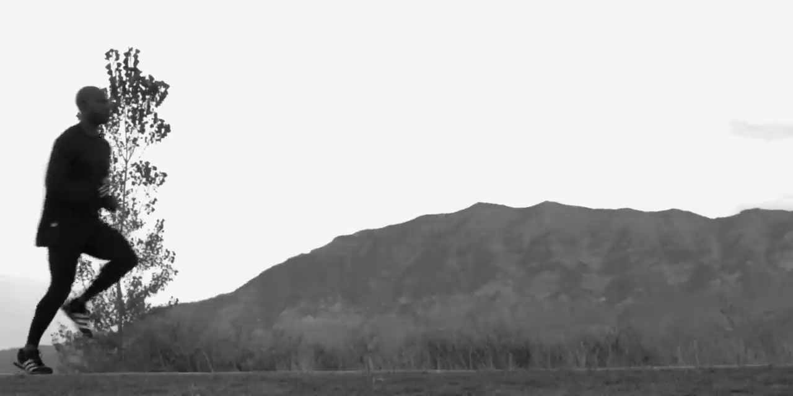
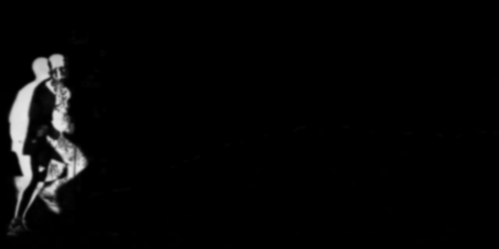
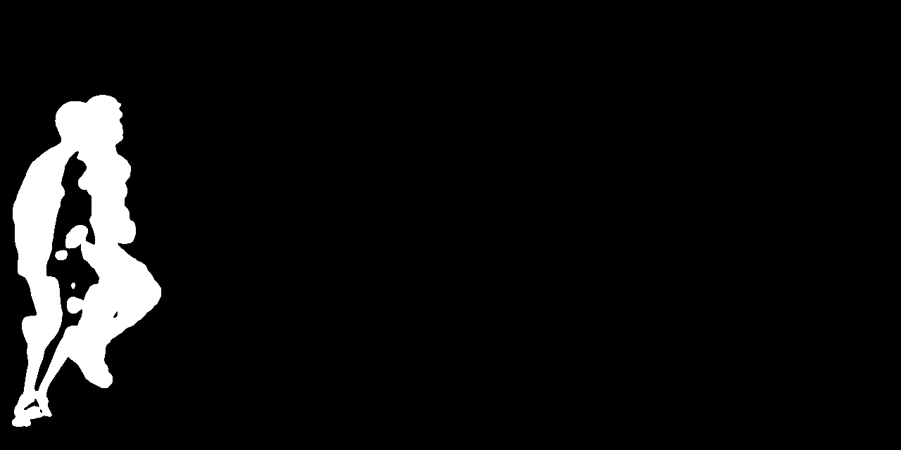
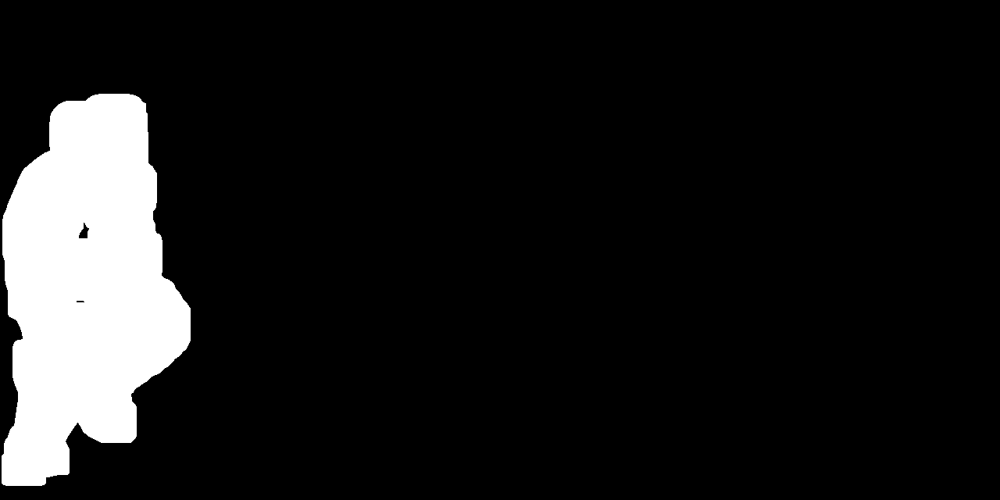
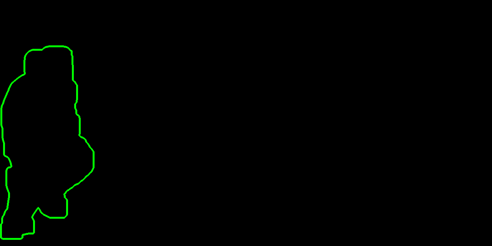
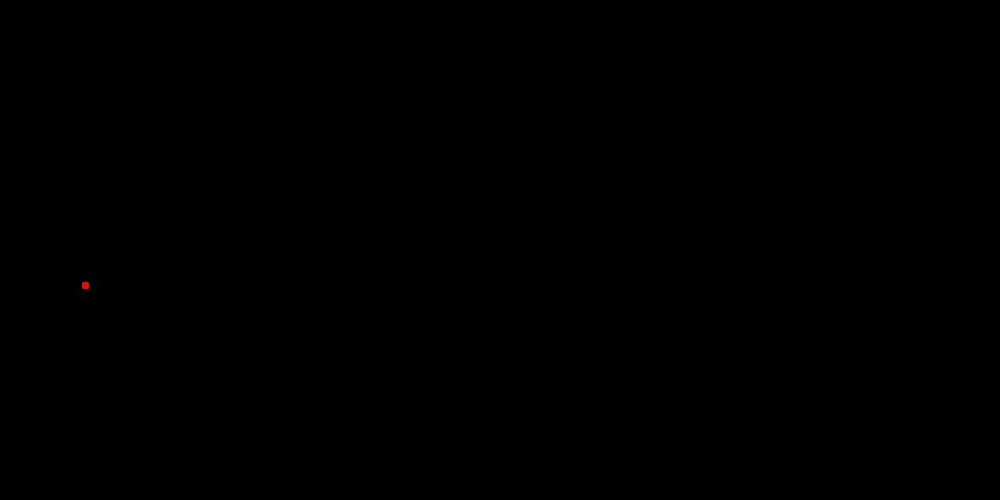
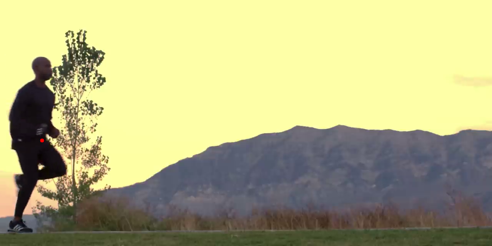

## Abstract

This project aims to measure the speed of a running person with as little hardware requirements as possible. It is a proof of concept focusing only on the position and speed detection, and doesn't aim to provide a good user interface.

## Measurement method

To measure speed, a camera is placed on the side of the running zone, so that the runner goes perpendicular to the camera's viewing direction (obviously, the camera is placed quite far away to provide a large enough viewing field).

The program then takes images at a regular interval and computes the absolute difference image from each two consecutive images. This outputs a black image with white spots wherever an object has moved, which means our running person is a white spot too.

Once we have this image with spots, we can easily run it through a pipeline of operations using OpenCV. To illustrate this, let's take two images and run through their processing steps:




First, we turn them into grayscale to ease all following steps:

```python
im1_gray = cv.cvtColor(im1, cv.COLOR_BGR2GRAY)
im2_gray = cv.cvtColor(im2, cv.COLOR_BGR2GRAY)
```




Then, their absolute difference is computed:

```python
diff = cv.absdiff(im1_gray, im2_gray)
```


The resulting image is blurred to cancel out sensor noise:

```python
blurred = cv.GaussianBlur(diff, (15, 15), 0)
```



Now, a threshold is applied to keep only the locations that have had enough movement (here, a 10/255 change over the brightness range), and set them all to the value 255 to make a binary image.

```python
_, thresh = cv.threshold(blurred, 10, 255, cv.THRESH_BINARY)
cv.imwrite('output/5_thresh.png', thresh)
```



This binary image can now be _dilated_, meaning that we will expand the white zones. This is done to avoid having unlinked spots for one person which would result in multiple positions in the end and could add error to filtered positions.

```python
dilated = cv.dilate(thresh, None, iterations=15)
```



Now we can find the contours of the white zones:

```python
contours, _ = cv.findContours(dilated, cv.RETR_EXTERNAL, cv.CHAIN_APPROX_NONE)
```



And find the centers of those contours (see the OpenCV documentation for a good explanation of this code):

```python
centers = []
for contour in contours:
    M = cv.moments(contour)
    if M['m00'] != 0:
        center = (int(M['m10'] / M['m00']), int(M['m01'] / M['m00']))
        centers.append(center)
```



And voilà, we have found the center of the runner between the two images.



This technique works very well since it doesn't make any assumptions on the number of moving objects on the image: it just finds as much as there are, and if there are multiple they can be filtered out later.

The full program for this can be found in the "paper-example" directory of the Git repository[^1].

## Position filtering

After recording positions as described above, the problem of filtering out unwanted positions needs to be tackled.

This avoids accounting for e.g. leaves moving, birds flying through the image, etc. in the final calculation.

We found that a known property of the runner's position on the running field is that it's a monotonic sequence, either increasing or decreasing depending on the running direction.

Let's suppose that the recording lasted just the time of the running: the positions of the runner will probably be the _longest monotonic sequence_ that can be found in the recording.

We found a good way to do this filtering by using a directed graph through the `networkx` python library:

```python
import networkx as nx
from typing import Any, Callable

def find_longest_monotonic_sequence(
    src: list[Any],
    item_to_number: Callable[[Any], float],
    direction=None,
) -> list:
    """
    Find the longest monotonic sequence in a list of numbers.
    :param src: the source list
    :param direction: 1 for increasing, -1 for decreasing, None for both
    :param item_to_number: a function to convert an item of the list to a number
    :return: the longest monotonic sequence
    """

    if direction is None:
        return max(
            find_longest_monotonic_sequence(src, item_to_number, 1),
            find_longest_monotonic_sequence(src, item_to_number, -1),
            key=len
        )

    # Create a directed graph
    G = nx.DiGraph()

    # Add nodes representing the indices of the input list
    G.add_nodes_from(range(len(src)))

    for i in range(len(src)):
        for j in range(len(src)):
            # For each pair of indices i and j
            if i >= j:
                # We want the outputted sequence to keep the order of the input
                continue
            if direction * item_to_number(src[i]) >= direction * item_to_number(src[j]):
                # The relation of monotonicity is not satisfied (increasing or decreasing)
                continue
            # Add an edge from i to j
            G.add_edge(i, j)

    # Find the longest path
    longest_path = nx.dag_longest_path(G)

    # Return the longest monotonic sequence
    return [src[i] for i in longest_path]

```

## Calculating real world position from pixel abscissa on the camera view

Although this aspect hasn't been quite explored with this project because we mainly focused on image processing, here is a draft of a technique for converting the position on the image to the real-world one.

In this section, the following values are defined:

- @@x\_{max} \in \mathbb{N}@@ is the horizontal pixel count of the camera divided by two.
- @@x \in [ -x_{max}; x_{max}]@@ is the pixel abscissa that has been found as described above, representing the "center" of our object.
- @@\theta\_{max} \in [ 0; 90 [@@ is the horizontal viewing angle of the camera.
- @@h \in \mathbb{R^{+*}}@@ is the distance to the running field.

The following values will be calculated:

- @@\theta \in [-\theta_{max};\theta_{max}]@@, the angle to the moving object relative to the center.
- @@d \in [-b_{max};b_{max}]@@, the position of the object.
- @@d\_{max} \in \mathbb{R^{+*}}@@, the half of the running field width.

All angles will be expressed in degrees.

<svg width="120" height="230" xmlns="http://www.w3.org/2000/svg" style="float:right;">
  <line x1="5" y1="205" x2="55" y2="5" stroke="var(--fg-color)" />
  <line x1="5" y1="205" x2="55" y2="205" stroke="var(--fg-color)" />
  <line x1="55" y1="205" x2="105" y2="205" stroke="var(--fg-color)" stroke-width="2" />
  <line x1="55" y1="205" x2="55" y2="5" stroke="var(--fg-color)" stroke-width="2" />
  <line x1="105" y1="205" x2="55" y2="5" stroke="var(--fg-color)" stroke-width="2" />
  <text x="60" y="155" fill="var(--fg-color)">h</text>
  <text x="75" y="200" fill="var(--fg-color)">d</text>
  <text x="65" y="20" fill="var(--fg-color)">Camera</text>
  <text x="5" y="225" fill="var(--fg-color)">Running field</text>
  <path d="M 55 205 H 65 V 195 H 55 Z" fill="transparent" stroke="var(--fg-color)" stroke-width="2" />
</svg>

First, the real-world angle from the center of the camera view @@\theta@@ can be calculated:

$$
\dfrac{x}{x_{max}} = \dfrac{\theta}{\theta_{max}}
\Rightarrow \theta = x \times \dfrac{\theta_{max}}{x_{max}}
$$

This approximation is only acceptable if the camera aims straight horizontally and to the height of the running person; if not the camera needs to be calibrated in order to account for lens distortion.

To make sure this is done right by the end user, the camera view could be cut to only leave a third of the image horizontally (this is done in the example code).

Now, the real-world distance to center @@d@@ of the object can be found:

$$
\dfrac{d}{\sin\theta} = \dfrac{h}{\sin(90-\theta)}
\Rightarrow d = \dfrac{h}{\sin(90-\theta)} \times \sin\theta
$$

These calculations can be summed up as follows (here we add the @@d\_{max}@@ variable, which may then be given to the user for them to know the running field width).

```python
from math import sin, radians

theta = x * thetamax / xmax
d = h/sin(radians(90-theta)) * sin(radians(theta))
dmax = thetamax/sin(radians(90-thetamax)) * sin(radians(thetamax))
```

<div style="clear: both;" />

## Caveats

There are two caveats with this measurement method that weren't mentioned yet:

- On the edges of the camera viewing angles, the fact that the runner isn't entirely visible anymore might cause the measured speed to be less than the real world one, since the center of the contours will still be in the image, even if there is only a hand peaking through.
- The camera viewing angle needs to be measured. As the most common way to specify viewing angles on product pages is for the _diagonal_ and not the _horizontal_, it would need to be calculated by reversing the function described above.

## Conclusion

We have shown that measuring real world speed with a camera is indeed possible on a large distance.

The method described in this paper is, as far as I know, the only one that is so cheap and works so well on a medium distance (GPS's are too imprecise, LiDARs are too expensive, and accelerometers that are precise enough for this are pretty expensive too).

[^1]: The code for this project is available on [Github](https://github.com/tarneaux/cvrace) and [the Renn.es Gitea instance](https://git.renn.es/tarneo/cvrace).
