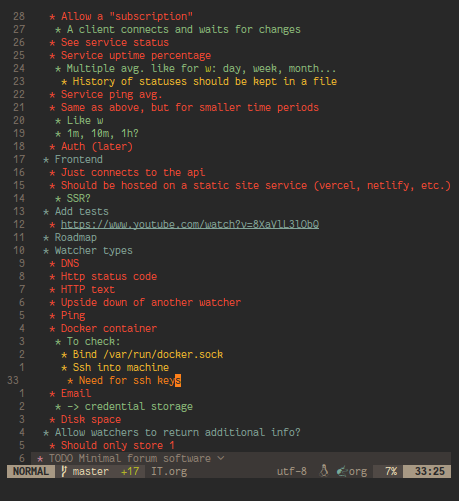

For the past few months, I've been using [Orgmode](https://orgmode.org/) to take notes. Just in case you've never heard of it, it's kind of like Markdown on steroids for "organizing your life" (hence the name). It was originally made for use in GNU Emacs but also has a [plugin](https://github.com/nvim-orgmode/orgmode) for Neovim and even an Android app, [Orgzly](https://orgzly.com/). I would also describe it as the "everything markup language": you can do anything you want with it, including documentation, literate programming[^1] and notes.

[^1]: [wikipedia](https://en.wikipedia.org/wiki/Literate_programming): "Literate programming is a programming paradigm introduced in 1984 by Donald Knuth in which a computer program is given as an explanation of how it works in a natural language, such as English, interspersed (embedded) with snippets of macros and traditional source code, from which compilable source code can be generated. The approach is used in scientific computing and in data science routinely for reproducible research and open access purposes. Literate programming tools are used by millions of programmers today."

I use it primarily for notes and to do lists, and sync the files between my phone and computer, and that's what I am going to talk about in this article.

## The notes

> "Choose the right tool for the job, not the right job for the tool."

My workflow with orgmode is very simple: It is organized like a tree of headings which describe one thing each: if I want to outline a project and its features, I'll put a heading with the name of the project in one of my org files, say `IT.org` (which right now is a 500-line abomination of a tree with only 6 top-level headings). This heading will probably be a second-level heading inside of my "projects" top-level heading. Then I will list out the main features of said project.

Let's see an example:

```org
* Projects
...
** Swec
*** API
**** Allow a "subscription"
***** A client connects and waits for changes
**** See service status
**** Service uptime percentage
***** Multiple avg. like for ~w~: day, week, month...
****** History of statuses should be kept in a file
**** Service ping avg.
**** Same as above, but for smaller time periods
***** Like w
***** 1m, 10m, 1h?
**** Auth (later)
*** Frontend
**** Just connects to the api
**** Should be hosted on a static site service (vercel, netlify, etc.)
***** SSR?
*** Add tests
**** [[https://www.youtube.com/watch?v=8XaVlL3lObQ]]
*** Roadmap
*** Watcher types
**** DNS
**** Http status code
**** HTTP text
**** Upside down of another watcher
**** Ping
**** Docker container
***** To check:
****** Bind /var/run/docker.sock
****** Ssh into machine
******* Need for ssh keys
**** Email
***** -> credential storage
**** Disk space
*** Allow watchers to return additional info?
**** Should only store 1
```

This is very simple syntax that should remind you about markdown, if you ever used it. Each heading is defined with a number of stars which tells which level it is.

By now you're probably thinking "this is boring", and I'll bet you already know what sentence follows: if it's boring, it's perfect. If a tool is boring, it has a high chance of being _the best tool for the job_: it's simple, and there is practically no learning curve.

Having this plain text syntax does not mean it it's ugly; look at how I configured Nvim to display it:



To make the syntax prettier, I just installed the orgmode plugin I already mentioned above, and then configured it to hide leading stars[^2] and emphasis markers[^3].

[^2]: On each line, replace all stars but the last one by spaces, making the text look indented.
[^3]: Hide symbols that change the formatting (like `*` `*bold text*` or `/` for `/italicized text/`). Though we still want to be able to edit the text easily, so we show those symbols anyway when the cursor is on the same line.

## Using it on the go

Very often I want to add something to my notes while on the go, and that's why I also have the Android app [Orgzly](https://orgzly.com/). It doesn't do anything incredible: it's just a way to edit the same notes on your phone. The tricky part for me was just figuring out how to sync org files between my phone and computer(s) without using any spyware "services" of tech giants. I also migrated away from [Nextcloud](https://nextcloud.com/) because I think they are also starting to have a monopoly. After looking for a symmetric sync (to and from the server) app for about a month, I ended up using [syncthing](https://syncthing.net/) because of the lack of a better alternative. In the end it's alright, even though the app randomly disconnects from the server sometimes. On my computer I use [unison](https://github.com/bcpierce00/unison) with a [custom script](https://raw.githubusercontent.com/tarneaux/.f/master/zsh/.config/scripts/unison-sync) that re-syncs every few seconds and complains loudly if it fails to sync five times in a row (which happens when large files are changed before they are done syncing). Unison and Syncthing both connect to the same [server](https://renn.es/) and that's it!

## What about [insert feature]?

Orgmode has too much features, which can be well illustrated by the length of the documentation[^4]. However I can list out some of these here:
- TODO keywords: Org can highlight and autocomplete any keywords you'd like. Most people will have something like "TODO", "NEXT", and "DONE", and I added "TOREAD" and "TOWRITE" onto these.
- URLs: `[[https://tarneo.fr]]` makes a link to this site. `[[https://tarneo.fr/][really nice site]]` adds a title to it.
- Tags: Each heading can have tags, and I mainly use them for things I still need to think about, e.g. "Do I really need this"?

[^4]: I ran a script on the [documentation index page](https://orgmode.org/manual/Main-Index.html) and it counted over a thousand links. That's a thousand documentation pages!

## Conclusion

What else is there left to say? Most other note-taking apps only allow you to take linear (=non-hierarchical) notes, which I think is a shame. Orgmode, on the other hand, lets you work however you want (in my case with trees of notes) and supports many features, such as very rich links. Most other note-taking apps will also either be proprietary, work only on your phone or only on your computer, have a bad syncing mechanism or even a server component that needs to be run somewhere (looking at you, Joplin).

Anyway, I don't think I'll switch away from it soon as it allows me to use the editor I want (unlike things like Obsidian which have their own bloated editor) and lets me organize my stuff how I want without making me spend hours on customizing (Notion).
