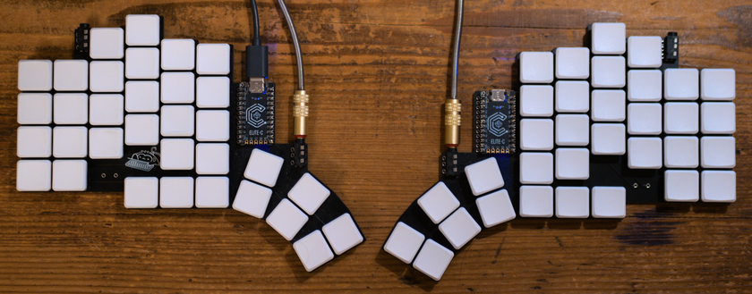

This post is about my journey to make my own (highly inefficient, but already better than standard) split keyboard, which looks like this:

It is a 4x6 split keyboard with an **enormous** 9-key thumbfan, and I'll go into all the details about what that it is and how I made it in this article.

I call it the monkeyboard and sometimes the supersplit.

## Building the keyboard

Around a year ago, I was looking for the best mechanical keyboard I could find. I stumbled on [Ben Vallack's channel](https://www.youtube.com/channel/UC4NNPgQ9sOkBjw6GlkgCylg), more specifically on [this video about making a fully custom keyboard using Ergogen](https://www.youtube.com/watch?v=UKfeJrRIcxw).

When I first watched the video, I immediately opened a terminal and started copying what Ben said. The start was pretty easy: to define your layout, just make a first column, and then add some other columns to it, to make a main matrix. Then add a thumb fan[^1] and boom, you have your layout. But then came the hard part: He just said "and then obviously start adding all the other bits that you need". I was incredibly overwhelmed by what that meant, and looked at the Ergogen documentation for the next few hours. I then had a first PCB prototype that I could open in KiCad and that would theoretically work. But I wasn't over yet, and changed my config file for the next few days. Eventually I stumbled upon [this repository](https://github.com/scipioni/clavis) that was almost perfect: I just needed to add a few keys to the main matrix and the thumb fan to get the layout I wanted.

For the next few weeks, I changed the layout multiple times, wanting it to be perfect for my hands, did a lot of back-and-forth with KiCad, and one day I was happy with the design I had. So I calculated the price for the whole keyboard, and there found out that there was no cheap service for printing/laser cutting/making the top plate in Paris. So I just chose to not buy the plate, which actually wasn't a bad choice as I think that would have made no difference.

I calculated the total price for the keyboard (around 200 euros with shipping), bought the parts first, waited for them to arrive, verified that the communications between the two micro-controllers worked as I thought, and then bought the PCB. Two weeks later it arrived, and I was able to build it with a borrowed soldering iron (which actually had a horribly bent tip). After two consecutive days of soldering (which was actually a lot easier than I thought), I eventually had my keyboard done.

## Assigning the keys and getting used to the layout

I decided to use the colemak layout, as it looked like it was quite good and I didn't want to use the old french azerty layout anymore. Once I had figured out how QMK worked for split keyboards (you can find my config [here](https://github.com/tarneaux/qmk_firmware/tree/master/keyboards/supersplit)), it was easy to make a PR on github and add my keyboard to the [online configuration tool](https://config.qmk.fm/). I noticed an issue there: if you want to use that tool, you HAVE to pollute the main repository, which because of this has 847 different keyboards implemented (at the time of writing). This is because the configurator fetches the main qmk_firmware repo.

Once the keys were assigned, I hopped onto [a typing trainer](https://monkeytype.com/) and started practicing, and at first my speed was miserable (around 5 words per minute). I typed for around two weeks until I was able to get to decent speeds (around 60).

I then started using the keyboard normally.

## Using french letters (éèàçù)
One downside of QMK is that I couldn't use the french keyboard layout (because characters that needed alt gr to be typed weren't appearing on the graphical configuration tool). For two months I used the keyboard without accents, but one day I had the idea to use the F13 to F24 keys with something capturing them on the PC. I first tried to add shortcuts to my linux window manager (awesomewm) and then use [xdotool](https://man.archlinux.org/man/xdotool.1.en) to type the characters. I immediately noticed that typing those characters only worked sometimes. So I chose to use [xmodmap](https://wiki.archlinux.org/title/xmodmap) to change the actions of those keys, which worked like a charm. The only issue is that you have to run `xmodmap ~/.Xmodmap` each time you disconnect the keyboard (this most certainly has a fix, but I just don't mind having to type that from time to time).

## What I would do differently if I built this keyboard again

First things off: making your own keyboard takes time, and I almost made a mistake by not using diodes in my build (see why they're needed [here](https://deskthority.net/wiki/Rollover,_blocking_and_ghosting), in short it's to prevent ghosting). But if you want to make your own, here are some things that I learned along the way:
- You don't need many keys. In fact, the six outer keys of my thumb cluster and the upper row of my matrix have no assigned actions! I also don't use the corners of the remaining matrix, except for the print screen key (which could just be on another layer). In general, small is better, and I think the best size for a keyboard is something like the 6-column [corne](https://github.com/foostan/crkbd), maybe even the 5-column one. On a split keyboard, you will notice if a key is too far away, and that's the case for my 12 middle thumb keys.
- You can just buy another keyboard. I think the [corne](https://github.com/foostan/crkbd) can be the right keyboard for anyone willing to take a bit of time learning a new layout, even if the pinky stagger is maybe not aggressive enough for my hands, plus it's **cheap**.

[^1]:On a traditional keyboard, both thumbs press only one key. This is highly inefficient as, well, you don't need two fingers to press one key. Have you never noticed the fact that one of your thumbs is never doing anything? Ergonomic keyboards have two main ways of mitigating this problem, mainly thumb clusters (typically multiple keys on multiple rows, which I don't really like because the outer keys are typically too far) and thumb fans (just an arc of keys).

