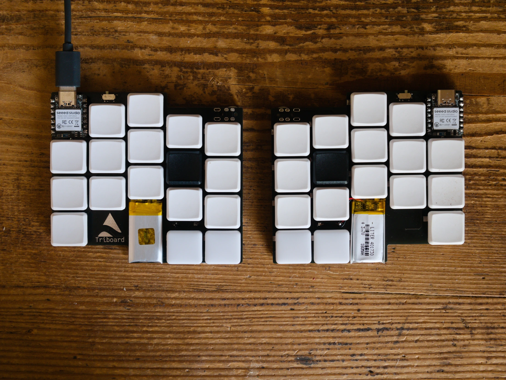

For the second time, I've designed a keyboard with [ergogen](https://github.com/ergogen/ergogen). Here it is:

This board:
- Is tiny, less than 10x10 cm for each half, making it easy to carry in a point-and-shoot camera carrying bag.
- Can be made wired or wireless. The wireless version (the one I built) only supports two thumb keys instead of three on each side to leave space for the battery.
- Is cheap (as far as split keyboards go): the whole build cost me less than 90 euros with shipping. The reversible PCB greatly helps with this.
- Can be modified to fit your hands: the four stagger values (pinky to ring, ring to middle, middle to index, index to inner) are defined at the top of the ergogen YAML file and should be changeable without having to worry too much about the rest.
- Supports Kailh Choc hotswap sockets for the switches.

## Design

I started off this project with a nice idea: I wanted a magnetic link in the middle to attach the halves and make a board that's comfortable to use on your lap. There would be a kind of magnet bracket to hold two or three neodymium magnets on each side, made out of a few PCBs with square cutouts. These would then be screwed together and to the main board.

Long story short, I abandoned this idea, mainly because there was no real point (the board can just be laid on top of a laptop's keyboard) and because it made the board bigger, but also because it was hard to define within ergogen (although I'm sure it would have worked out).

When starting the design, I discovered the wonderful new version of ergogen with multiple quality of life improvements, the most notable ones being a much more decent documentation and not having to place additional footprints in `node_modules`.

To make it a bit smaller, I even made a [flippable Seeed XIAO footprint](https://github.com/tarneaux/triboard/blob/v0.1.0/footprints/xiao_flippable.js) which, as the name suggests, allows the XIAO to be soldered on either side of the PCB, only needing solder bridges on the same side to avoid shorts.

## Pink switches

For this board, I chose pink Choc switches instead of the heavier red ones I had put in my previous one, going from 50gf to 20gf. I definitely don't regret it, but I'm still getting used to them after a week. It makes typos more common when pressing keys that are not on the home positions (i.e. when having to move your fingers). I tried typing on my previous keyboard as a test and there's a very noticeable difference: red switches really just feel too heavy now and I won't go back.

## Home row mods

With a < 36-key board, it's just impossible to have modifiers on the thumb keys if you also want to access the secondary layers easily. My first attempt was to use combos: each hand would have a combo on the ring and index fingers, super on the left, control on the right. This worked just fine, but today I started using [Urob's timeless home row mods](https://github.com/urob/zmk-config#timeless-homerow-mods), which feel much better than basic home row mods. I think I'll be keeping them as it's what seems most usable.

## Bluetooth and battery life

As already mentioned, I built the wireless version of this keyboard, which is why I'm using ZMK. For now I've noticed a single issue: sometimes (around once every two hours), the right controller goes to sleep while typing. When trying to check voltage on the 3.3v pin with a multimeter, it comes back and reconnects, just as when turning it off and on again. I'm not sure about why this happens yet.

I have only charged the board once for now, and I think (and hope) the batteries where not full when I bought them. I'll update this article when the battery runs out on the left half (which should happen before the right one does). The ZMK power profiler predicts around two weeks of battery life on the left half.

## Conclusion

I'm very happy with how this keyboard turned out. I built it in a way that should make it usable by other people too, so feel free to build one yourself (please [tell me](/) if you do!).

This is probably not the last keyboard I'll ever make, but for now it's great in terms of portability. Using it on the go is actually possible now, as opposed to the [monkeyboard](/posts/split_keyboard/).

If you liked this article, consider reading ones from other people like Rousette's [TOTEM](https://www.rousette.org.uk/archives/totem-keyboard/) and [Nine](https://www.rousette.org.uk/archives/introducing-the-nine-keyboard/) or nerdypepper's [Programming on 34 keys](https://peppe.rs/posts/programming_on_34_keys/).
