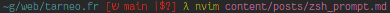

I thought I would share my Zsh prompt here, mainly the part that shows the git status:



First, you'll need to tell Zsh to run the commands in the `$PROMPT` variable each time it runs:
```zsh
setopt prompt_subst
```
Without this, Zsh would run the commands only once (when parsing the zshrc), making functions useless for the prompt.

You guessed it, we'll functions. The names start with an underscore to prevent them from showing up in autocomplete.
```zsh
function _git_symbols() {
}

function _git_info() {
}
```

Following is the config I use for the prompt, with a lambda as the prompt character. The comments explain it all, so I won't go into more detail.
```zsh
PROMPT=''
# PROMPT+='%F{yellow}%n@%m ' # Display the username followed by @ and hostname in yellow
PROMPT+='%F{blue}%~' # Display the current working directory in blue
PROMPT+='%F{red}$(_git_info)%f ' # Display the vcs info in red
PROMPT+='%(?.%F{green}λ .%F{red}λ )' # Display a green prompt if the last command succeeded, or red if it failed
PROMPT+='%f' # Reset the text color
```

Now on to those functions. The first one, `_git_symbols()`, will echo a number of symbols displaying information about our current git status:
- **↑** if we are are ahead of at least one remote (we can push changes).
- **↓** if we are behind (we can pull changes).
- **↕** if the local and remote branch diverge (we have commits on each side after the last one we had in common).
- **|** if we are up to date with the remotes.
- None of the above when we have no remote configured, which can actually be useful sometimes.
- **+** if there are staged changes.
- **?** if there are untracked files.
- **!** if we modified files.
- **>** if we moved files.
- **x** if we deleted a file.
- **$** if we have stashed changes.

Let's put those in the function:
```zsh
function _git_symbols() {
	# Symbols
	local ahead='↑'
	local behind='↓'
	local diverged='↕'
	local up_to_date='|'
	local no_remote=''
	local staged='+'
	local untracked='?'
	local modified='!'
	local moved='>'
	local deleted='x'
	local stashed='$'
}
```

The rest should have enough comments. Capital words indicate the parts that are being checked in the next paragraph.
```zsh
function _git_symbols() {
    ...
	local output_symbols=''

	local git_status_v
	git_status_v="$(git status --porcelain=v2 --branch --show-stash 2>/dev/null)"

	# Parse branch information
	local ahead_count behind_count

	# AHEAD, BEHIND, DIVERGED
	if echo $git_status_v | grep -q "^# branch.ab " ; then
		# One line of the git status output looks like this:
		# # branch.ab +1 -2
		# In the line below:
		# - we grep for the line starting with # branch.ab
		# - we grep for the numbers and output them on separate lines
		# - we remove the + and - signs
		# - we put the two numbers into variables, while telling read to use a newline as the delimiter for reading
		read -d "\n" -r ahead_count behind_count <<< $(echo "$git_status_v" | grep "^# branch.ab" | grep -o -E '[+-][0-9]+' | sed 's/[-+]//')
		# Show the ahead and behind symbols when relevant
		[[ $ahead_count != 0 ]] && output_symbols+="$ahead"
		[[ $behind_count != 0 ]] && output_symbols+="$behind"
		# Replace the ahead symbol with the diverged symbol when both ahead and behind
		output_symbols="${output_symbols//$ahead$behind/$diverged}"

		# If the branch is up to date, show the up to date symbol
		[[ $ahead_count == 0 && $behind_count == 0 ]] && output_symbols+="$up_to_date"
	fi

	# STASHED
	echo $git_status_v | grep -q "^# stash " && output_symbols+="$stashed"

	# STAGED
	[[ $(git diff --name-only --cached) ]] && output_symbols+="$staged"

	# For the rest of the symbols, we use the v1 format of git status because it's easier to parse.
	local git_status

	symbols="$(git status --porcelain=v1 | cut -c1-2 | sed 's/ //g')"

	while IFS= read -r symbol; do
		case $symbol in
			??) output_symbols+="$untracked";;
			M) output_symbols+="$modified";;
			R) output_symbols+="$moved";;
			D) output_symbols+="$deleted";;
		esac
	done <<< "$symbols"

	# Remove duplicate symbols
	output_symbols="$(echo -n "$output_symbols" | tr -s "$untracked$modified$moved$deleted")"

	[[ -n $output_symbols ]] && echo -n " $output_symbols"
}
```

Now that this function is done, let's see the next one, `_git_info()`. It verifies we are in a git repository, and then makes the rest of the prompt:
- the branch name
- the brackets around the git status for style
```zsh
function _git_info() {
	local git_info=''
	local git_branch_name=''

	if git rev-parse --is-inside-work-tree >/dev/null 2>&1; then
		# Get the Git branch name
		git_branch_name="$(git symbolic-ref --short HEAD 2>/dev/null)"
		if [[ -n "$git_branch_name" ]]; then
			git_info+="ש $git_branch_name"
		fi
		# Get the Git status
		git_info+="$(_git_symbols)"
		echo " [$git_info]"
	fi
}
```

## Conclusion

Now we have a *relatively* simple prompt in plain shell which will work anywhere git and Zsh do. I originally wrote it for my Gentoo [server](https://renn.es/) where I didn't want to install the [starship](https://starship.rs/) prompt I was using at the time. These days I ditched starship and only use this prompt everywhere!

The entire code is available [here](https://git.renn.es/.f-servers/blob/main/zsh/.zshrc#L141), in the "Prompt" section.
